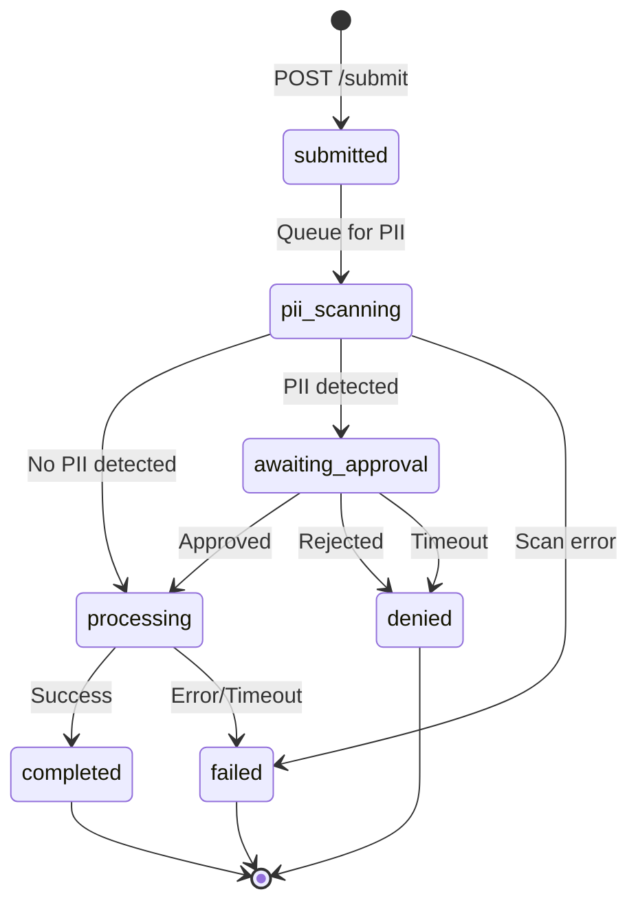

# Equalify PDF Converter - Architecture Reference

## Overview

The Equalify PDF Converter is a monolithic Python application with background task queuing that transforms PDF course materials into accessible, semantic HTML for University of Illinois Chicago (UIC). The system enforces a strict architectural boundary: **course materials only** - no student records or personally identifiable information (PII) should reach processing stages.

**Architecture Pattern:** Monolith with Background Task Queue

- **Single Python Application:** One FastAPI process with multiple background worker threads
- **Asynchronous Processing:** Redis task queues enable non-blocking API responses
- **PII-First Design:** All documents undergo PII scanning before AI processing
- **Resilient Storage:** S3 operations use circuit breakers and exponential backoff retry
- **Containerized Everything:** Docker Compose for local development, AWS ECS for production

## Technology Stack

### Backend Framework

- **Python 3.11+** - Modern async/await support, type hints
- **FastAPI 0.115+** - High-performance async web framework
- **Uvicorn** - ASGI server with hot-reload support
- **Pydantic 2.0+** - Data validation and settings management
- **uv** - Fast Python package manager (replaces pip/poetry)

### AI/ML Processing

- **PydanticAI 1.0+** - Multi-agent AI orchestration framework
- **AWS Bedrock** - Claude AI models via AWS Bedrock
- **IBM Docling 2.55+** - PDF to Markdown conversion with OCR
- **Microsoft Presidio 2.2+** - PII detection and entity recognition
- **spaCy 3.7** - NLP models for Presidio (en_core_web_sm)

### Infrastructure

- **Redis 5.0+** - Task queues, job state, rate limiting, distributed locks
- **AWS S3** - Object storage for PDFs and results
- **LocalStack** - Local AWS emulation for development
- **Docker & Docker Compose** - Containerized services

### Monitoring & Observability

- **Prometheus** - Metrics collection and storage
- **Grafana** - Metrics visualization and dashboards
- **OpenTelemetry** - Distributed tracing instrumentation
- **prometheus-client** - Python metrics exporter

### Testing

- **pytest 7.4+** - Test framework
- **pytest-asyncio** - Async test support
- **pytest-xdist** - Parallel test execution
- **pytest-cov** - Coverage reporting
- **testcontainers** - Real Redis/S3 for integration tests
- **httpx** - Async HTTP client for API tests
- **reportlab** - PDF generation for test fixtures

### Deployment

- **AWS ECS Fargate** - Container orchestration (production)
- **AWS ElastiCache** - Managed Redis (production)
- **AWS CloudWatch** - Logging and monitoring (production)
- **Terraform** - Infrastructure as Code

## High-Level Architecture Diagram

```
┌─────────────────────────────────────────────────────────────┐
│                    CLIENT APPLICATION                        │
│                    (Web UI / API)                             │
└──────────────────────────┬──────────────────────────────────┘
                           │ HTTP/REST
                           ▼
┌─────────────────────────────────────────────────────────────┐
│                  FASTAPI APPLICATION                         │
│  ┌──────────────────────────────────────────────────────┐   │
│  │              API ENDPOINTS                           │   │
│  │  • POST /api/v1/documents/submit                        │   │
│  │  • GET  /api/v1/documents/{id}                          │   │
│  │  • GET  /api/v1/documents/{id}/result                   │   │
│  │  • GET  /api/v1/approval/{token}/review                 │   │
│  │  • POST /api/v1/approval/{token}/decision               │   │
│  │  • GET  /health                                      │   │
│  └──────────────────────────────────────────────────────┘   │
│  ┌──────────────────────────────────────────────────────┐   │
│  │              MIDDLEWARE STACK                        │   │
│  │  1. CORS                                             │   │
│  │  2. Logging (request/response)                       │   │
│  │  3. Rate Limiting (Redis sliding window)             │   │
│  │  4. Error Handler (global exception catching)        │   │
│  │  5. Metrics (Prometheus instrumentation)             │   │
│  └──────────────────────────────────────────────────────┘   │
│  ┌──────────────────────────────────────────────────────┐   │
│  │          BACKGROUND WORKERS (Threads)                │   │
│  │  • PII Worker        (BLPOP eq-pdf:queue:pii)        │   │
│  │  • Timeout Worker    (Scheduled cleanup)             │   │
│  │  • Processing runs via FastAPI BackgroundTasks       │   │
│  └──────────────────────────────────────────────────────┘   │
└─────────────────────────────────────────────────────────────┘
                           │
                           │ Redis/S3/Bedrock
                           ▼
┌─────────────────────────────────────────────────────────────┐
│                INFRASTRUCTURE SERVICES                       │
│  ┌─────────────┐  ┌─────────────┐  ┌─────────────────────┐ │
│  │   Redis     │  │  AWS S3     │  │   AWS Bedrock       │ │
│  │             │  │             │  │   (Claude AI)       │ │
│  │  • Queues   │  │  • Temp     │  │                     │ │
│  │  • Job State│  │  • Results  │  │  • Haiku (fast)     │ │
│  │  • Locks    │  │  • Archive  │  │  • Sonnet (quality) │ │
│  └─────────────┘  └─────────────┘  └─────────────────────┘ │
└─────────────────────────────────────────────────────────────┘
```

## Complete Directory Structure

```
src/
├── __init__.py
├── main.py                         # FastAPI app + lifespan (worker startup)
├── config.py                       # Pydantic Settings (env vars → typed config)
├── dependencies.py                 # FastAPI dependency injection providers
│
├── api/                            # REST API Endpoints
│   ├── __init__.py
│   ├── documents.py                # POST /submit, GET /status, GET /result
│   ├── approval.py                 # POST /approve, POST /reject
│   ├── health.py                   # GET /health, GET /metrics
│   └── dev_monitoring.py           # Dev-only: GET /api/dev/monitoring/queues
│
├── workers/                        # Background Task Processors
│   ├── __init__.py
│   ├── pii_worker.py               # Monitors eq-pdf:queue:pii (Microsoft Presidio)
│   └── timeout_worker.py           # Scheduled: approval timeouts, temp cleanup, orphan detection
│   # Note: Document processing runs via FastAPI BackgroundTasks, not a separate worker
│
├── services/                       # Business Logic Layer
│   ├── __init__.py
│   ├── storage_service.py          # S3 operations (upload/download/delete/presigned URLs)
│   ├── queue_service.py            # Redis queue operations (LPUSH/BLPOP/LLEN)
│   ├── job_service.py              # Job state management (Redis hashes + TTL)
│   ├── pii_service.py              # PII detection orchestration
│   ├── pii_analyzer.py             # Microsoft Presidio wrapper
│   ├── pipeline_viewer.py          # Core 7-step versioned processing pipeline
│   ├── document_processing_service.py # Pipeline orchestration + S3/Redis integration
│   ├── pdf_extractor.py            # Docling text extraction
│   ├── approval_service.py         # Approval workflow (token validation, state transitions)
│   ├── timeout_service.py          # Approval timeout monitoring (sorted sets)
│   ├── cleanup_service.py          # Denied job file cleanup
│   ├── orphan_service.py           # Orphaned job detection and cleanup
│   ├── s3_cleanup_service.py       # S3 temporary file cleanup
│   ├── rate_limit_service.py       # Rate limiting (Redis sliding window)
│   └── metrics_service.py          # Prometheus metrics tracking
│
├── middleware/                     # FastAPI Middleware
│   ├── __init__.py
│   ├── cors.py                     # CORS headers configuration
│   ├── logging_middleware.py       # Request/response logging
│   ├── rate_limit.py               # Rate limiting middleware (uses rate_limit_service)
│   ├── error_handler.py            # Global exception handling and error formatting
│   └── metrics.py                  # Prometheus metrics collection
│
├── agents/                         # AI Prompt Modules (PydanticAI)
│   ├── __init__.py
│   ├── model_tiers.py              # Model selection (Haiku/Sonnet tier mapping)
│   └── prompts/                    # Agent prompt templates (structure, boundary, footnote)
│
├── shared/                         # Data Models and Constants
│   ├── __init__.py
│   ├── models/                     # Pydantic Models
│   │   ├── __init__.py
│   │   ├── job.py                  # Job, JobCreate, JobUpdate, JobStatus
│   │   ├── queue.py                # QueueMessage, PIIQueuePayload, ProcessingQueuePayload
│   │   ├── pii.py                  # PIIFinding, PIIResult, PIIApprovalRequest
│   │   ├── processing.py           # ProcessingResult, ProcessingError
│   │   ├── approval.py             # ApprovalRequest, ApprovalResponse
│   │   └── redis_schema.py         # Redis data structure schemas
│   └── constants/                  # Application Constants
│       ├── __init__.py
│       ├── queues.py               # Queue names (QUEUE_PII, QUEUE_PROCESSING)
│       ├── redis_keys.py           # Redis key patterns (job:*, timeout:*, metrics:*)
│       └── statuses.py             # Job status constants (SUBMITTED, PII_SCANNING, etc.)
│
└── utils/                          # Utility Functions
    ├── __init__.py
    ├── circuit_breaker.py          # Circuit breaker pattern for S3 resilience
    ├── confidence_scoring.py       # AI quality confidence calculation
    ├── text_cleanup.py             # Text normalization and cleanup
    ├── token_generator.py          # Secure approval token generation
    └── retry_helpers.py            # Exponential backoff retry decorators
```

## Application Layers

### 1. API Layer (FastAPI)

**Technology:** FastAPI 0.115+
**Purpose:** REST API endpoints for document submission, status tracking, results retrieval, and approval workflow
**Pattern:** Async request handlers with dependency injection

#### Files

**`api/documents.py`** - Document lifecycle management

- `POST /api/v1/documents/submit` - Submit PDF for processing (returns job_id)
- `GET /api/v1/documents/{job_id}` - Check processing status
- `GET /api/v1/documents/{job_id}/result` - Retrieve processed HTML/MDX with presigned URLs

**`api/approval.py`** - Human approval workflow

- `GET /api/v1/approval/{token}/review` - Get job details for PII review (requires token)
- `POST /api/v1/approval/{token}/decision` - Submit approval/denial decision (requires token)

**`api/health.py`** - Health checks and metrics

- `GET /health` - Application health status (Redis/S3 connectivity)
- `GET /metrics` - Prometheus metrics endpoint

**`api/dev_monitoring.py`** - Development-only endpoints (disabled in production)

- `GET /api/dev/monitoring/queues` - Real-time queue depths and job counts

### 2. Service Layer (Business Logic)

**Technology:** Pure Python classes with async/await
**Purpose:** Shared business logic, external service integration, data orchestration
**Pattern:** Dependency injection via FastAPI `Depends()`

#### Storage & State Management

**`services/storage_service.py`** - S3 operations

- Upload PDFs to temp bucket, results to permanent bucket
- Download files for processing
- Generate presigned URLs for client downloads
- Circuit breakers for resilience (upload/download/delete circuits)
- Exponential backoff retry on transient errors

**`services/queue_service.py`** - Redis queue operations

- `enqueue()` - LPUSH to Redis lists (eq-pdf:queue:pii, eq-pdf:queue:processing)
- `dequeue()` - BLPOP with timeout for graceful shutdown
- `queue_depth()` - LLEN for monitoring

**`services/job_service.py`** - Job state management

- Create job metadata in Redis hashes (eq-pdf:job:{job_id})
- Update status with automatic TTL (7 days active, 30 days completed)
- Retrieve job details with status filtering
- Atomic state transitions

#### PII Detection

**`services/pii_service.py`** - PII detection orchestration

- Coordinate PDF download, text extraction, Presidio scanning
- Handle approval workflow initiation
- Store PII findings in job metadata

**`services/pii_analyzer.py`** - Microsoft Presidio wrapper

- Initialize Presidio AnalyzerEngine with spaCy models
- Detect entities (PERSON, EMAIL_ADDRESS, PHONE_NUMBER, SSN, etc.)
- Return structured PII findings with confidence scores

#### Document Processing

**`services/processing_service.py`** - Main processing pipeline

- Orchestrate PDF → Markdown → AI-enhanced HTML workflow
- Manage multi-stage processing with error recovery
- Calculate confidence scores
- Store results in S3 with versioning

**`services/pdf_converter.py`** - Docling PDF → Markdown

- Convert PDF to Markdown with page images
- Handle multi-page documents
- OCR for scanned documents
- Preserve document structure (headings, lists, tables)

**`services/pdf_extractor.py`** - Docling text extraction

- Extract raw text for PII scanning (faster than full conversion)
- Normalize whitespace and formatting

**`services/ai_enhancement_service.py`** - AI accessibility enhancement

- Process pages concurrently (configurable concurrency)
- Add alt text to images
- Improve heading hierarchy
- Add ARIA labels for semantic structure
- Retry failed pages with exponential backoff

#### Approval & Cleanup

**`services/approval_service.py`** - Approval workflow

- Generate secure approval tokens (cryptographically random)
- Validate tokens and approval state
- Transition jobs from awaiting_approval → processing (approved) or denied (rejected)
- Trigger cleanup for denied jobs

**`services/timeout_service.py`** - Approval timeout monitoring

- Monitor Redis sorted set for expired approvals (eq-pdf:timeouts:approval)
- Auto-reject documents after timeout (default: 4 hours)
- Remove from timeout queue on approval/rejection

**`services/cleanup_service.py`** - Denied job cleanup

- Delete temp files from S3 when job is rejected
- Remove job metadata from Redis
- Log cleanup actions for audit trail

**`services/s3_cleanup_service.py`** - S3 temporary file cleanup

- Periodic cleanup of temp files older than retention period (default: 24 hours)
- List and delete in batches for efficiency
- Track cleanup metrics

**`services/orphan_service.py`** - Orphaned job detection

- Detect jobs stuck in processing state beyond max processing time (default: 2 hours)
- Mark as failed with timeout reason
- Clean up orphaned S3 files

#### Infrastructure Services

**`services/rate_limit_service.py`** - Rate limiting

- Redis sliding window algorithm
- Per-IP and global rate limits
- Configurable time windows and request limits

**`services/metrics_service.py`** - Prometheus metrics

- Track job counts by status
- Monitor queue depths
- Record processing times
- S3 operation metrics (success/failure/circuit_breaker state)
- Cleanup operation metrics

### 3. Worker Layer (Background Processing)

**Technology:** Asyncio tasks managed by FastAPI lifespan
**Purpose:** Asynchronous background job processing
**Pattern:** Blocking queue consumers with graceful shutdown

#### Files

**`workers/pii_worker.py`** - PII detection worker

- `BLPOP eq-pdf:queue:pii` - Wait for PII scan jobs
- Download PDF from S3 temp bucket
- Run Microsoft Presidio scan
- **If clean:** Queue for processing (LPUSH eq-pdf:queue:processing)
- **If PII found:** Update status to awaiting_approval, add to timeout queue
- Graceful shutdown on signal (completes current job, max 30s)

**Document Processing** (via FastAPI BackgroundTasks)

- `DocumentProcessingService.process_document()` runs as background task
- Downloads PDF from S3
- `PipelineViewerService` runs 7-step versioned pipeline (Docling → Structure → Headings → Pages → Code Blocks → Boundaries → Cleanup)
- Stores final markdown + figures to S3 results bucket
- Updates job state to "completed" with cost/token metadata

**`workers/timeout_worker.py`** - Scheduled maintenance worker

- **Approval timeout checks** (every 30 seconds)
  - `ZRANGEBYSCORE eq-pdf:timeouts:approval` - Find expired approvals
  - Auto-reject and cleanup
- **Temp file cleanup** (every 1 hour)
  - Delete S3 temp files older than retention period
- **Orphan detection** (every 4 hours)
  - Find jobs stuck in processing state
  - Mark as failed, cleanup S3 files
- **Metrics cleanup** (every 24 hours)
  - Aggregate and archive old metrics
- Graceful shutdown on signal

### 4. Middleware Layer (Cross-Cutting Concerns)

**Technology:** FastAPI middleware stack
**Purpose:** Request/response interception for logging, security, metrics
**Pattern:** Starlette BaseHTTPMiddleware

#### Execution Order

FastAPI middleware executes in reverse order of registration (last added = first executed):

1. **`middleware/cors.py`** - CORS headers
   - Allow origins, methods, headers for web clients
   - Configurable for dev (localhost) vs production domains

2. **`middleware/logging_middleware.py`** - Request/response logging
   - Log request method, path, status, duration
   - Structured JSON logging for CloudWatch

3. **`middleware/rate_limit.py`** - Rate limiting enforcement
   - Check rate limits before processing request
   - Return 429 Too Many Requests if exceeded
   - Uses `RateLimitService` (Redis sliding window)

4. **`middleware/error_handler.py`** - Global exception handling
   - Catch all unhandled exceptions
   - Return structured error responses (RFC 7807 Problem Details)
   - Log errors with stack traces
   - Hide internal errors from clients (security)

5. **`middleware/metrics.py`** - Prometheus instrumentation
   - Track request counts by method/endpoint/status
   - Record request duration histograms
   - Monitor active requests gauge

### 5. Data Models Layer (Pydantic)

**Technology:** Pydantic 2.0+
**Purpose:** Type-safe data validation, serialization, API contracts
**Pattern:** BaseModel with Field validators

#### Files

**`shared/models/job.py`** - Job lifecycle models

- `Job` - Complete job with all fields (status, s3_key, result URLs, timestamps)
- `JobCreate` - Minimal fields for job creation (filename, content_type)
- `JobUpdate` - Partial update model (status, s3_key, error_message)
- `JobStatus` - Read-only status response for clients

**`shared/models/queue.py`** - Queue message payloads

- `QueueMessage` - Base message (job_id, timestamp)
- `PIIQueuePayload` - PII scan job (job_id, s3_key)
- `ProcessingQueuePayload` - Processing job (job_id, s3_key, approved_at)

**`shared/models/pii.py`** - PII detection models

- `PIIFinding` - Presidio entity result (entity_type, start, end, score)
- `PIIResult` - Scan result (has_pii, findings, confidence)
- `PIIApprovalRequest` - Approval action (job_id, decision, justification)

**`shared/models/processing.py`** - Processing results

- `ProcessingResult` - Complete result (markdown_url, confidence_score)
- `ProcessingError` - Structured error (stage, error_type, message, retryable)

**`shared/models/approval.py`** - Approval workflow

- `ApprovalRequest` - Client request (decision, justification, token)
- `ApprovalResponse` - Server response (accepted, new_status, message)

**`shared/models/redis_schema.py`** - Redis data structure documentation

- Type definitions for Redis hash fields
- Key patterns and naming conventions
- TTL policies

### 6. Constants Layer (Application Configuration)

**Technology:** Python constants
**Purpose:** Centralized constant definitions, prevent magic strings
**Pattern:** Module-level constants

#### Files

**`shared/constants/statuses.py`** - Job status constants

```python
SUBMITTED = "submitted"
PII_SCANNING = "pii_scanning"
AWAITING_APPROVAL = "awaiting_approval"
PROCESSING = "processing"
COMPLETED = "completed"
FAILED = "failed"
DENIED = "denied"
```

**`shared/constants/queues.py`** - Queue names

```python
QUEUE_PII = "eq-pdf:queue:pii"
QUEUE_PROCESSING = "eq-pdf:queue:processing"
```

**`shared/constants/redis_keys.py`** - Redis key patterns

```python
JOB_PREFIX = "eq-pdf:job:"
TIMEOUT_PREFIX = "eq-pdf:timeouts:"
METRICS_PREFIX = "eq-pdf:metrics:"
LOCK_PREFIX = "eq-pdf:lock:"
```

### 7. Utilities Layer (Helper Functions)

**Technology:** Pure Python utility functions
**Purpose:** Reusable logic for retry, scoring, text processing
**Pattern:** Stateless functions

#### Files

**`utils/circuit_breaker.py`** - Circuit breaker pattern

- `CircuitBreaker` class with states (CLOSED, OPEN, HALF_OPEN)
- Track consecutive failures (threshold: 5)
- Timeout before recovery test (60 seconds)
- Separate circuits for S3 upload/download/delete

**`utils/retry_helpers.py`** - Exponential backoff retry

- `retry_with_backoff_for_sync_func()` - Async wrapper for synchronous functions with exponential backoff
- `retry_with_backoff()` - Async version for async functions
- Categorize errors as retriable vs non-retriable
- Max attempts: 3, base delay: 1s, max delay: 8s

**`utils/confidence_scoring.py`** - AI quality scoring

- Calculate overall confidence from page-level scores
- Weight by page length
- Classify as HIGH (>0.85), MEDIUM (0.60-0.85), LOW (<0.60)

**`utils/text_cleanup.py`** - Text normalization

- Remove excessive whitespace
- Normalize line endings
- Fix common PDF extraction artifacts
- Preserve code blocks and preformatted text

**`utils/token_generator.py`** - Secure token generation

- Generate cryptographically secure random tokens for approval URLs
- URL-safe base64 encoding
- Configurable token length (default: 32 bytes → 43 characters)

## Processing Pipeline: Stage-by-Stage Flow

### Stage 1: Document Submission

**Endpoint:** `POST /api/v1/documents/submit`
**Duration:** <100ms
**Status:** `submitted` → `pii_scanning`

#### Flow

1. Client uploads PDF file (max 100MB)
2. API validates:
   - Content type is `application/pdf`
   - File size within limit
   - Basic PDF header check
3. Generate job_id (UUID4)
4. Upload PDF to S3 temp bucket: `s3://equalify-pdf-temp/{job_id}.pdf`
5. Create job in Redis:

   ```python
   HSET eq-pdf:job:{job_id}
     status "pii_scanning"
     s3_key "temp/{job_id}.pdf"
     filename "course-syllabus.pdf"
     created_at "2025-01-15T10:00:00Z"
   ```

6. Queue for PII scanning:

   ```python
   LPUSH eq-pdf:queue:pii '{"job_id": "...", "s3_key": "temp/..."}'
   ```

7. Return immediately:

   ```json
   {
     "job_id": "abc-123-def-456",
     "status": "pii_scanning",
     "estimated_completion_minutes": 5
   }
   ```

#### Edge Cases

- **File too large (>100MB):** Return `413 Payload Too Large`
- **Invalid PDF:** Return `400 Bad Request` with validation error
- **S3 upload failure:** Retry 3 times, then return `503 Service Unavailable`
- **Redis unavailable:** Return `503 Service Unavailable` (can't track job)

### Stage 2: PII Detection & Scanning

**Worker:** `pii_worker.py`
**Duration:** 10-30 seconds
**Status:** `pii_scanning` → `processing` OR `awaiting_approval`

#### Flow

1. PII worker blocks on queue:

   ```python
   job = BLPOP eq-pdf:queue:pii 60  # 60s timeout for graceful shutdown
   ```

2. Download PDF from S3 temp bucket
3. Extract text using Docling (fast extraction, no images)
4. Run Microsoft Presidio scan:
   - Detect entities: PERSON, EMAIL_ADDRESS, PHONE_NUMBER, SSN, CREDIT_CARD, etc.
   - Return findings with confidence scores (0.0-1.0)
5. **Decision point:**

   **If NO PII detected** (findings empty):
   - Update job status to `processing`
   - Queue for processing:

     ```python
     LPUSH eq-pdf:queue:processing '{"job_id": "...", "s3_key": "..."}'
     ```

   **If PII detected** (findings exist):
   - Generate secure approval token
   - Update job:

     ```python
     HSET eq-pdf:job:{job_id}
       status "awaiting_approval"
       pii_findings '[{"entity_type": "PERSON", "score": 0.95, ...}]'
       approval_token "secure-random-token"
       expires_at "2025-01-15T14:00:00Z"  # +4 hours
     ```

   - Add to timeout queue:

     ```python
     ZADD eq-pdf:timeouts:approval 1705329600 "{job_id}"  # Unix timestamp
     ```

   - Send email notification to faculty (future phase)

#### Edge Cases

- **PII scan timeout (>60s):** Retry once, then mark as failed
- **Presidio service unavailable:** Queue for retry with exponential backoff
- **False positives:** Common patterns (e.g., "CS 101") added to allowlist
- **Text extraction failure:** Mark as failed with error message
- **S3 download failure:** Retry with exponential backoff, then fail

### Stage 3: Human Approval Workflow

**Endpoint:** `POST /api/v1/documents/{job_id}/approve` OR `/reject`
**Duration:** Variable (human decision)
**Status:** `awaiting_approval` → `processing` (approved) OR `denied` (rejected)

#### Approval Flow

1. Faculty receives notification with:
   - Job ID
   - PII findings (entity types, redacted snippets)
   - Secure approval URL with token
2. Faculty reviews findings and decides:
   - **Approve:** Course material, false positive, acceptable risk
   - **Reject:** Contains PII, not appropriate for processing
3. API validates:
   - Job exists and status is `awaiting_approval`
   - Approval token matches stored token
   - Not expired (within 4-hour window)
4. **If approved:**
   - Update status to `processing`
   - Remove from timeout queue: `ZREM eq-pdf:timeouts:approval {job_id}`
   - Queue for processing: `LPUSH eq-pdf:queue:processing {...}`
   - Log approval decision with justification
5. **If rejected:**
   - Update status to `denied`
   - Remove from timeout queue
   - Trigger cleanup: Delete S3 temp file, remove job metadata after 7 days
   - Log rejection decision with justification

#### Edge Cases

- **Approval timeout (>4 hours):** Timeout worker auto-rejects and cleans up
- **Invalid token:** Return `403 Forbidden`
- **Double approval:** First valid approval wins, subsequent ignored
- **Already processed:** Return `409 Conflict` (status changed)
- **Email delivery failure:** Log warning, user can check status via API

### Stage 4: Document Processing

**Service:** `DocumentProcessingService` + `PipelineViewerService`
**Trigger:** FastAPI BackgroundTasks (inline, not a separate worker)
**Duration:** 2-8 minutes
**Status:** `processing` → `completed` OR `failed`

#### Flow

1. `DocumentProcessingService.process_document()` runs as a background task
2. Download PDF from S3 temp bucket
3. **PipelineViewerService** runs 7-step versioned pipeline:
   - **Step 1 - Docling extraction (v0):** PDF → markdown + page images (30-90s)
   - **Step 2 - Structure analysis:** AI identifies headings, footnotes, page types per-page
   - **Step 3 - Heading level fix:** Deterministic heading hierarchy normalization
   - **Step 4 - Page content corrections (v1):** AI fixes OCR errors per-page (parallel, semaphore-limited)
   - **Step 5 - Code block tagging:** Identify programming languages in code blocks
   - **Step 6 - Cross-page boundary fixes (v2):** Rejoin split content, relocate footnotes
   - **Step 7 - Final cleanup (v3):** Normalize whitespace and formatting
4. Each step produces a versioned snapshot (v0, v1, v2, v3) with complete markdown for review
5. **Store results in S3:**
   - Upload final markdown + extracted figures to results bucket
   - Store change ledger (audit trail of all AI edits)
6. **Update job:**

   ```python
   HSET eq-pdf:job:{job_id}
     status "completed"
     markdown_url "jobs/{job_id}/final.md"
     confidence_score "0.87"
     llm_cost_cents "5.25"
     completed_at "2025-01-15T10:05:23Z"
   ```

#### Edge Cases

- **Processing timeout (>10 minutes):** Kill job, mark as failed
- **Individual page AI failures:** Log error, keep original markdown for that page
- **S3 upload failure:** Retry 3 times, then mark job as failed
- **Malformed PDF:** Docling failures handled, return structured error
- **Circuit breaker open (S3 degraded):** Fail fast, retry later

### Stage 5: Result Delivery

**Endpoint:** `GET /api/v1/documents/{job_id}/result`
**Duration:** <50ms
**Status:** `completed` (no change)

#### Flow

1. Client polls for result (or uses webhook in future phase)
2. API retrieves job from Redis: `HGET eq-pdf:job:{job_id}`
3. Validate status is `completed`
4. Return result:

   ```json
   {
     "job_id": "abc-123-def-456",
     "status": "completed",
     "markdown_url": "https://s3.../result.md?X-Amz-...",
     "confidence_score": 0.87,
     "review_recommended": false,
     "processing_time_seconds": 243,
     "completed_at": "2025-01-15T10:05:23Z"
   }
   ```

5. Client downloads files from presigned URLs
6. Result URLs expire after 7 days (regenerate if needed)

#### Edge Cases

- **Job not found:** Return `404 Not Found`
- **Job still processing:** Return `202 Accepted` with status and ETA
- **Job failed:** Return `200 OK` with status `failed` and error message
- **Presigned URL expired:** Regenerate on demand (requires S3 access)

## Background Services: Scheduled Maintenance

### Timeout Cleanup Worker

**Schedule:** Every 30 seconds
**Purpose:** Enforce approval deadlines, prevent indefinite holds

#### Operations

1. **Check expired approvals:**

   ```python
   expired_jobs = ZRANGEBYSCORE eq-pdf:timeouts:approval 0 {current_timestamp}
   ```

2. For each expired job:
   - Check job status (race condition protection)
   - If still `awaiting_approval`:
     - Update status to `denied`
     - Delete S3 temp file
     - Remove from timeout queue
     - Log auto-rejection event
3. **Check stuck processing jobs:**
   - Find jobs in `processing` state older than 2 hours
   - Mark as `failed` with timeout reason
   - Cleanup S3 files

#### Edge Cases

- **Redis unavailable:** Skip cycle, log warning, retry next cycle
- **S3 deletion failure:** Log error, mark for manual cleanup, continue
- **Race condition (job approved during cleanup):** Check status again before deletion

### Temporary File Cleanup

**Schedule:** Every 1 hour
**Purpose:** Prevent S3 storage bloat from temp files

#### Operations

1. List files in temp bucket older than retention period (24 hours)
2. Filter files not associated with active jobs:
   - Extract job_id from S3 key
   - Check job status in Redis
   - Skip if job is `pii_scanning`, `awaiting_approval`, or `processing`
3. Delete in batches (max 1000 per batch)
4. Track metrics: files deleted, bytes freed, errors

### Orphan Detection

**Schedule:** Every 4 hours
**Purpose:** Detect and cleanup orphaned jobs and data

#### Operations

1. **Find orphaned jobs:**
   - Jobs in `processing` state older than `max_processing_hours` (2 hours)
   - Jobs with S3 files but no Redis metadata
   - Redis jobs with no corresponding S3 files
2. **Cleanup actions:**
   - Mark stuck jobs as `failed`
   - Delete orphaned S3 files
   - Remove orphaned Redis keys
3. **Alert on high orphan rate** (>5% of jobs)

## State Machine: Job Status Transitions



### Status Definitions

- **`submitted`** - Initial state, PDF uploaded to S3, queued for PII
- **`pii_scanning`** - PII worker processing, Microsoft Presidio scan in progress
- **`awaiting_approval`** - PII detected, waiting for human decision (4-hour timeout)
- **`processing`** - Approved or clean, Docling + AI enhancement in progress
- **`completed`** - Success, HTML/MDX stored in S3, results available
- **`failed`** - Error occurred (scan failure, processing timeout, S3 error)
- **`denied`** - Rejected by faculty or auto-rejected on timeout

### Terminal States

- **`completed`** - TTL: 30 days in Redis, permanent in S3
- **`failed`** - TTL: 30 days in Redis, no S3 results
- **`denied`** - TTL: 7 days in Redis, S3 temp files deleted immediately

## Redis Data Structures: Deep Dive

### Application Namespace: `eq-pdf:*`

All Redis keys use the `eq-pdf:` prefix for namespacing.

### 1. Task Queues (Redis Lists)

Used for background job processing with blocking operations.

```python
# PII scanning queue
eq-pdf:queue:pii = [
  '{"job_id": "abc-123", "s3_key": "temp/abc-123.pdf", "created_at": "2025-01-15T10:00:00Z"}',
  '{"job_id": "def-456", "s3_key": "temp/def-456.pdf", "created_at": "2025-01-15T10:01:00Z"}'
]

# Processing queue (approved or clean documents)
eq-pdf:queue:processing = [
  '{"job_id": "ghi-789", "s3_key": "temp/ghi-789.pdf", "approved_at": "2025-01-15T10:05:00Z"}',
  '{"job_id": "jkl-012", "s3_key": "temp/jkl-012.pdf", "approved_at": null}'
]
```

**Operations:**

- **Enqueue:** `LPUSH eq-pdf:queue:pii '{...}'` (left push, FIFO order)
- **Dequeue:** `BRPOP eq-pdf:queue:pii 60` (blocking right pop, 60s timeout)
- **Depth:** `LLEN eq-pdf:queue:pii` (queue length for monitoring)

**Why Lists?**

- FIFO ordering (documents processed in submission order)
- Blocking operations (workers sleep when idle, wake on new jobs)
- Atomic operations (no race conditions)
- Persistence (jobs not lost on restart)

### 2. Job State (Redis Hashes)

Each job stores metadata in a Redis hash with automatic TTL.

```python
# Active job (pii_scanning, awaiting_approval, processing)
eq-pdf:job:abc-123 = {
  "status": "awaiting_approval",
  "s3_key": "temp/abc-123.pdf",
  "filename": "course-syllabus.pdf",
  "content_type": "application/pdf",
  "created_at": "2025-01-15T10:00:00Z",
  "updated_at": "2025-01-15T10:00:45Z",
  "pii_findings": '[{"entity_type": "PERSON", "score": 0.95}]',
  "approval_token": "secure-random-token-here",
  "expires_at": "2025-01-15T14:00:45Z"
}

# Completed job
eq-pdf:job:def-456 = {
  "status": "completed",
  "s3_key": "temp/def-456.pdf",
  "filename": "lecture-notes.pdf",
  "markdown_url": "https://s3.../result.md?X-Amz-...",
  "confidence_score": "0.87",
  "created_at": "2025-01-15T10:01:00Z",
  "completed_at": "2025-01-15T10:05:23Z"
}

# Failed job
eq-pdf:job:ghi-789 = {
  "status": "failed",
  "s3_key": "temp/ghi-789.pdf",
  "error_message": "PDF extraction failed: Encrypted document",
  "error_stage": "pdf_conversion",
  "created_at": "2025-01-15T10:02:00Z",
  "failed_at": "2025-01-15T10:02:15Z"
}
```

**TTL Policy:**

- **Active jobs** (`pii_scanning`, `awaiting_approval`, `processing`): 7 days
- **Completed jobs:** 30 days
- **Failed jobs:** 30 days
- **Denied jobs:** 7 days

**Operations:**

- **Create:** `HSET eq-pdf:job:{job_id} status submitted ... | EXPIRE eq-pdf:job:{job_id} 604800`
- **Update:** `HSET eq-pdf:job:{job_id} status processing updated_at ...`
- **Read:** `HGETALL eq-pdf:job:{job_id}`
- **Delete:** `DEL eq-pdf:job:{job_id}` (or let TTL expire)

**Why Hashes?**

- Efficient storage (fields stored inline, not separate keys)
- Atomic field updates (status transitions without race conditions)
- Flexible schema (add fields as needed, no migration)
- TTL support (automatic cleanup, prevent memory leaks)

### 3. Timeout Tracking (Redis Sorted Sets)

Track approval deadlines with automatic expiration.

```python
# Sorted set: score = Unix timestamp (expiration time)
eq-pdf:timeouts:approval = {
  "abc-123": 1705329645.0,  # Expires at 2025-01-15 14:00:45 UTC
  "def-456": 1705330200.0,  # Expires at 2025-01-15 14:10:00 UTC
  "ghi-789": 1705331000.0   # Expires at 2025-01-15 14:23:20 UTC
}
```

**Operations:**

- **Add deadline:** `ZADD eq-pdf:timeouts:approval {timestamp} {job_id}`
- **Find expired:** `ZRANGEBYSCORE eq-pdf:timeouts:approval 0 {current_time}`
- **Remove:** `ZREM eq-pdf:timeouts:approval {job_id}`
- **Count pending:** `ZCARD eq-pdf:timeouts:approval`

**Why Sorted Sets?**

- Efficient range queries (find expired in O(log N + M))
- Automatic ordering (no need to sort)
- Score-based expiration (Unix timestamps as scores)
- Atomic operations (add/remove without locks)

### 4. Distributed Locks (Redis Strings with NX and EX)

Prevent duplicate processing and race conditions.

```python
# Lock format: eq-pdf:lock:{resource}
eq-pdf:lock:job:abc-123 = "worker-instance-id"  # EX 60 (expires in 60 seconds)
```

**Operations:**

- **Acquire:** `SET eq-pdf:lock:job:{job_id} {worker_id} NX EX 60`
- **Release:** `DEL eq-pdf:lock:job:{job_id}` (only if owner)

**Use Cases:**

- Prevent duplicate PII scans (if job re-queued)
- Prevent duplicate processing (if approval timeout and manual approval race)
- Cleanup operations (ensure one worker cleans temp files)

### 5. Metrics (Redis Hashes)

Track daily/weekly metrics for monitoring and billing.

```python
# Daily metrics (key: eq-pdf:metrics:daily:2025-01-15)
eq-pdf:metrics:daily:2025-01-15 = {
  "submissions": 45,
  "completed": 38,
  "failed": 2,
  "denied": 5,
  "pii_detected": 12,
  "pii_clean": 33,
  "avg_processing_time_seconds": 243,
  "total_pages_processed": 1234
}

# Weekly metrics (aggregated from daily)
eq-pdf:metrics:weekly:2025-W03 = {
  "submissions": 312,
  "completed": 285,
  ...
}
```

**TTL Policy:**

- Daily metrics: 90 days
- Weekly metrics: 2 years

## S3 Bucket Organization

### Temp Bucket: `equalify-pdf-temp`

**Purpose:** Store unvalidated PDFs during PII scanning and approval
**Lifecycle:** Files deleted after 24 hours OR when job completes/denied
**Access:** Private (API and workers only)

```
equalify-pdf-temp/
├── temp/
│   ├── abc-123-def-456.pdf        # Original uploaded PDF
│   ├── ghi-789-jkl-012.pdf
│   └── ...
```

**Lifecycle Policy:**

- Delete files older than 24 hours (backup cleanup)
- No versioning (temp files, not critical)

### Results Bucket: `equalify-pdf-results`

**Purpose:** Store processed HTML/MDX results
**Lifecycle:** Permanent storage with versioning
**Access:** Public read (presigned URLs for authenticated users)

```
equalify-pdf-results/
├── abc-123-def-456/
│   ├── final.md                   # Final semantic markdown
│   ├── ledger.json                # Change ledger (audit trail of AI edits)
│   └── metadata.json              # Processing metadata (confidence, timestamps)
├── ghi-789-jkl-012/
│   ├── result.html
│   ├── result.mdx
│   └── metadata.json
└── ...
```

**Lifecycle Policy:**

- Transition to Glacier after 1 year (cost optimization)
- Versioning enabled (support document updates)
- Server-side encryption (AES-256)

## Infrastructure: Local vs Production

### Comparison Table

| Component | Local Development | Production (AWS) |
|-----------|------------------|------------------|
| **Redis** | Docker container (`redis:latest`) | AWS ElastiCache (Redis 7.x, cluster mode) |
| **S3** | LocalStack container (port 4566) | AWS S3 (multi-region replication) |
| **AI Provider** | AWS Bedrock (us-east-1) OR Anthropic API | AWS Bedrock (us-east-1, production account) |
| **Monitoring** | Prometheus + Grafana (Docker) | AWS CloudWatch Logs + Metrics + Alarms |
| **Orchestration** | Docker Compose | AWS ECS Fargate (spot instances for cost) |
| **Networking** | Docker bridge network | AWS VPC with private subnets |
| **Load Balancer** | None (direct container access) | AWS ALB with health checks |
| **Secrets** | `.env` file (NOT committed) | AWS Secrets Manager |
| **IAM** | Static credentials (test/test) | ECS Task Role (no credentials in code) |
| **Logs** | Container stdout/stderr | CloudWatch Logs with structured JSON |
| **Domains** | localhost:8080 | equalify-pdf.uic.edu (Route 53) |
| **SSL/TLS** | None (local HTTP) | ACM certificate + ALB HTTPS termination |

### Local Development Setup

**Prerequisites:**

- Docker Desktop
- 8GB+ RAM (for LocalStack + containers)
- 20GB+ disk space

**Start services:**

```bash
make dev
# Equivalent to:
# docker-compose -f docker-compose.yml -f docker-compose.dev.yml up -d
```

**Services started:**

- **api-gateway** (port 8080) - FastAPI application
- **redis** (port 6379) - Task queues and state
- **localstack** (port 4566) - Local AWS emulation
- **demo-ui** (port 5173) - React demo frontend
- **prometheus** (port 9090) - Metrics collection
- **grafana** (port 3001) - Metrics visualization
- **redis-exporter** (port 9121) - Redis metrics

**Access points:**

- API: <http://localhost:8080>
- API Docs: <http://localhost:8080/docs>
- Metrics: <http://localhost:8080/metrics>
- Demo UI: <http://localhost:5173>
- Grafana: <http://localhost:3001> (admin/admin)
- Prometheus: <http://localhost:9090>

**Hot reload:**

- Source code mounted as read-only volume
- Uvicorn `--reload` watches for changes
- Tests mounted for containerized test runs

**Detailed setup:** See [docs/environment-setup-simplified.md](environment-setup-simplified.md)

### Production Deployment (AWS)

**Architecture:**

- **ECS Fargate:** Single task definition (API + workers), spot instances
- **ElastiCache:** Redis cluster (multi-AZ, automatic failover)
- **S3:** Two buckets (temp, results) with lifecycle policies
- **ALB:** Application Load Balancer with health checks
- **CloudWatch:** Logs, metrics, alarms
- **Secrets Manager:** API keys, database credentials

**Deployment process:**

1. Build Docker image with production target
2. Push to AWS ECR (Elastic Container Registry)
3. Update ECS task definition with new image tag
4. ECS performs rolling update (zero-downtime)
5. Health checks validate new tasks before switching traffic

**Infrastructure as Code:** See [scripts/deploy-aws.sh](../scripts/deploy-aws.sh) and [docs/aws-guide.md](aws-guide.md)

**Monitoring:**

- **CloudWatch Logs:** Structured JSON logs from containers
- **CloudWatch Metrics:** Custom metrics (queue depths, processing times)
- **CloudWatch Alarms:** Alert on error rates, queue backlogs, high latency
- **ECS Service Metrics:** CPU, memory, task health

## Resilience Patterns

### 1. S3 Circuit Breakers

**Problem:** S3 throttling or outages can cascade to entire application
**Solution:** Circuit breakers fail fast, allow recovery

#### Implementation

Three independent circuit breakers:

- **`upload_circuit`** - For `put_object`, `upload_fileobj`
- **`download_circuit`** - For `get_object`, `head_object`, `list_objects`
- **`delete_circuit`** - For `delete_object`, `delete_objects`

#### Circuit States

1. **CLOSED** (Normal operation)
   - Requests pass through to S3
   - Track consecutive failures
   - Threshold: 5 consecutive failures → OPEN

2. **OPEN** (Service degraded)
   - Requests blocked immediately (fail fast)
   - Raise `CircuitBreakerOpen` exception
   - Timeout: 60 seconds → HALF_OPEN

3. **HALF_OPEN** (Testing recovery)
   - Allow limited requests through
   - 2 consecutive successes → CLOSED
   - 1 failure → OPEN

#### Monitoring

Prometheus metrics:

```python
# Circuit breaker state (0=closed, 1=half-open, 2=open)
s3_circuit_breaker_state{circuit_name="s3-upload"} 0

# Operation results
s3_operations_total{operation="put_object", bucket="temp", result="success"} 1234
s3_operations_total{operation="put_object", bucket="temp", result="error"} 5
s3_operations_total{operation="put_object", bucket="temp", result="circuit_open"} 12

# Operation latency
s3_operation_duration_seconds{operation="put_object", bucket="temp"} 0.123
```

### 2. Exponential Backoff Retry

**Problem:** Transient errors (network blips, rate limits) fail operations unnecessarily
**Solution:** Retry with exponential backoff, categorize errors

#### Retry Logic

```python
max_attempts = 3
base_delay = 1.0  # seconds
max_delay = 8.0   # seconds

for attempt in range(1, max_attempts + 1):
    try:
        return s3_client.put_object(...)
    except ClientError as e:
        if is_retriable(e) and attempt < max_attempts:
            delay = min(base_delay * (2 ** (attempt - 1)), max_delay)
            sleep(delay)
            continue
        raise
```

#### Error Categorization

**Retriable errors** (temporary, retry):

- `503 Service Unavailable`
- `SlowDown` (rate limiting)
- `RequestTimeout`
- `InternalError`
- `ThrottlingException`

**Non-retriable errors** (permanent, fail immediately):

- `403 Forbidden` (permissions)
- `404 Not Found`
- `NoSuchKey`
- `AccessDenied`

#### Boto3 Adaptive Retry

Enabled in S3 client configuration:

```python
config = Config(
    retries={
        'mode': 'adaptive',  # Intelligent client-side rate limiting
        'max_attempts': 3
    }
)
```

### 3. Rate Limiting (Redis Sliding Window)

**Problem:** Prevent abuse, ensure fair resource allocation
**Solution:** Redis-based sliding window rate limiter

#### Algorithm

```python
# Track requests in time-sorted list
key = f"rate_limit:{ip_address}"
now = time.time()
window = 60  # seconds

# Remove old requests outside window
redis.zremrangebyscore(key, 0, now - window)

# Count requests in current window
count = redis.zcard(key)

# Check limit
if count >= limit:
    raise RateLimitExceeded("Too many requests")

# Add current request
redis.zadd(key, {request_id: now})
redis.expire(key, window)
```

#### Rate Limits

- **Per-IP:** 60 requests/minute
- **Global:** 1000 requests/minute
- **API endpoints:**
  - `POST /submit`: 10/minute per IP
  - `GET /status`: 120/minute per IP
  - `GET /result`: 120/minute per IP

### 4. Graceful Shutdown

**Problem:** Killing workers mid-job causes incomplete processing
**Solution:** Shutdown event signals workers to finish current job

#### Implementation

```python
shutdown_event = asyncio.Event()

async def worker_loop(shutdown_event):
    while not shutdown_event.is_set():
        job = await queue.dequeue(timeout=5)  # Short timeout for responsiveness
        if job:
            await process_job(job)  # Complete current job

# On shutdown signal
shutdown_event.set()
await asyncio.wait_for(worker_task, timeout=30)  # Max 30s grace period
```

#### Shutdown Sequence

1. Receive SIGTERM (Kubernetes/ECS termination)
2. Set shutdown event (workers stop accepting new jobs)
3. Wait for current jobs to complete (max 30 seconds)
4. Force cancel if timeout exceeded
5. Close Redis/S3 connections
6. Exit

## Architectural Decisions

### Why Monolith with Background Workers?

**Decision:** Single Python application with multiple worker threads
**Alternatives considered:** Microservices, separate worker processes

**Reasoning:**

- **Simplicity:** Shared codebase, single deployment, easier debugging
- **Shared state:** Direct access to Redis and S3 clients (no network overhead)
- **Development velocity:** Faster iteration, no inter-service communication
- **Resource efficiency:** Lower overhead than multiple containers
- **Sufficient scale:** UIC use case (<1000 documents/day, not Netflix-scale)

**Trade-offs:**

- Less flexible scaling (can't scale PII worker independently)
- Single point of failure (but ECS auto-restarts)
- Future migration path: Extract workers into separate services if needed

### Why Sorted Sets for Timeouts?

**Decision:** Redis sorted sets with Unix timestamps as scores
**Alternatives considered:** Background polling with `HGETALL` scans, separate timeout service

**Reasoning:**

- **Efficient queries:** `ZRANGEBYSCORE` finds expired in O(log N + M)
- **Automatic ordering:** No need to sort, Redis handles it
- **Atomic operations:** `ZADD`/`ZREM` prevent race conditions
- **Flexible deadlines:** Can extend timeout by updating score

**Trade-offs:**

- Requires scheduled worker (timeout worker runs every 30s)
- Not real-time (30s delay between timeout and action)

### Why Circuit Breakers for S3?

**Decision:** Independent circuit breakers for upload/download/delete
**Alternatives considered:** Simple retry, no circuit breaker, single shared circuit

**Reasoning:**

- **Fail fast:** Avoid waiting for timeouts when S3 is degraded
- **Cascading failure prevention:** Don't queue thousands of jobs when S3 is down
- **Independent failures:** Upload throttling shouldn't block downloads
- **Recovery testing:** Half-open state tests if S3 has recovered

**Trade-offs:**

- Complexity (state management, metrics)
- False positives (temporary failure could open circuit unnecessarily)

## Monitoring & Observability

### Health Checks

**Endpoint:** `GET /health`

```json
{
  "status": "healthy",
  "version": "0.1.0",
  "checks": {
    "redis": {"status": "ok", "latency_ms": 2},
    "s3": {"status": "ok", "latency_ms": 45},
    "workers": {
      "pii_worker": "running",
      "timeout_worker": "running"
    }
  },
  "uptime_seconds": 3600
}
```

### Prometheus Metrics

**Queue metrics:**

```
queue_depth{queue="pii"} 5
queue_depth{queue="processing"} 2
```

**Job metrics:**

```
jobs_total{status="completed"} 1234
jobs_total{status="failed"} 12
jobs_total{status="denied"} 5
```

**Processing metrics:**

```
processing_duration_seconds{stage="pii_scan"} 15.3
processing_duration_seconds{stage="docling_conversion"} 45.2
processing_duration_seconds{stage="ai_enhancement"} 123.4
```

**S3 metrics:**

```
s3_operations_total{operation="upload", result="success"} 1234
s3_circuit_breaker_state{circuit="upload"} 0
s3_operation_duration_seconds{operation="upload"} 0.123
```

### Grafana Dashboards

**Overview dashboard:**

- Jobs submitted (rate per minute)
- Jobs completed (rate per minute)
- Success rate (completed / submitted)
- Queue depths (real-time)
- Worker health (up/down)

**Performance dashboard:**

- P50/P95/P99 processing times
- API latency distribution
- S3 operation latency
- Redis operation latency

**Errors dashboard:**

- Error rate by type
- Failed jobs by reason
- Circuit breaker trips
- Retry attempts

## Related Documentation

- **[Environment Setup](environment-setup-simplified.md)** - Local development setup guide
- **[AWS Deployment Guide](aws-guide.md)** - Production deployment on AWS ECS
- **[Rate Limiting](rate-limiting.md)** - Rate limiting implementation details
- **[CI/CD](ci-cd.md)** - GitHub Actions workflows and deployment automation
- **[CLAUDE.md](../CLAUDE.md)** - AI agent development guide and patterns

## Version History

- **v0.1.0** (2025-01-15) - Initial architecture document
  - Complete file structure with all 50+ files
  - Technology stack with versions
  - Detailed processing pipeline (5 stages)
  - Redis data structures deep dive
  - Infrastructure comparison (local vs production)
  - Resilience patterns (circuit breakers, retry, rate limiting)
  - Merged content from program-flow.md
  - Edge cases and error handling
  - Performance characteristics
  - Monitoring and observability
